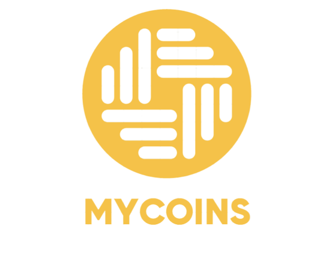

<h1 align="center"> MyCoins </h1>

 

MyCoins is an application dedicated to trading owners and people interested in it, helping them to know the popular currencies, currency fluctuations, and all important information for the trader.

With features such as adding to favorites, searching for the required currency, notifications from the application, and converting from trading currencies to international currencies such as the dollar and the Libyan dinar, as well as displaying all currency details with a graph showing the movement of the currency throughout the day, 15 days, or the past 30 days, in addition to that it is multiple Languages, dark mode and light mode

## Tools
- Firebase [Authentication,Cloud Firestore,Notification]
- EmailJS [Send Messaging in email]
- Flutter FrameWork
- Figma
- VS Code

## Techniques
- Api for get all Coins [https://api.coingecko.com/api/v3/coins/markets?vs_currency=usd&sparkline=true]
- Api for search coins[https://api.coingecko.com/api/v3/coins/marketsvs_currency=idr&order=market_cap_desc&per_page=100&page=1&sparkline=false]
- Api for get Chart Data[https://api.coingecko.com/api/v3/coins/${id}/market_chart?vs_currency=idr&days=$days]
- Api for send email used EmailJS [https://api.emailjs.com/api/v1.0/email/send]
- SignIn/SignUp/forget Password [Firebase for Authentication by Email and password]
- profile user [Get First and Last name  and token from SignUp Screen and Add to Cloud Firestore in Firebase]
- Favorites Coins [Get data from App all coins and Add to Cloud Firestore in Firebase]
- Conversion between Coins [Get List coins from Api Conver  Get List from data from App all coins and Add to Cloud Firestore in Firebase ]

## Sigup in app
1.Enter Your Really Email 
2.Enter Your Password 
3.Enter Your First Name 
4.Enter Your Last Name 
5.Press `Sign up `Button 

## Place
Benghazi camp

## Developers
The application that was created by [*Aya Alsaity* ](https://github.com/AyaAlsaity) &  [*Areej Elbarassi*](https://github.com/areej9891)
## Programming supervisor
[*Mohamed Alsaee*](https://github.com/mohamed97alsaee)
